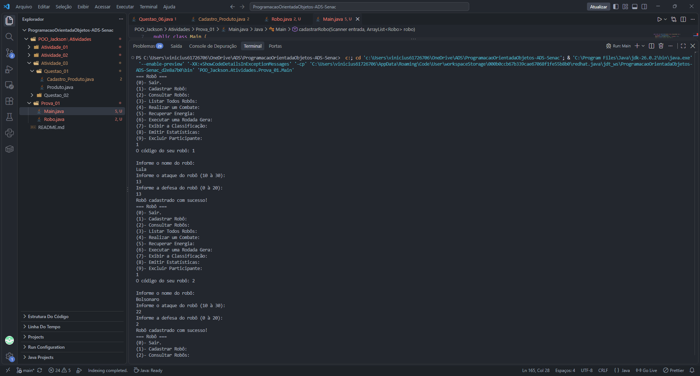
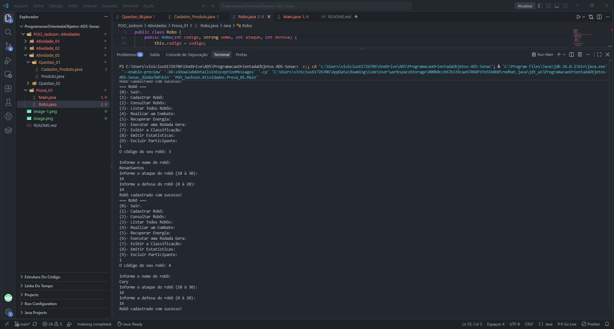
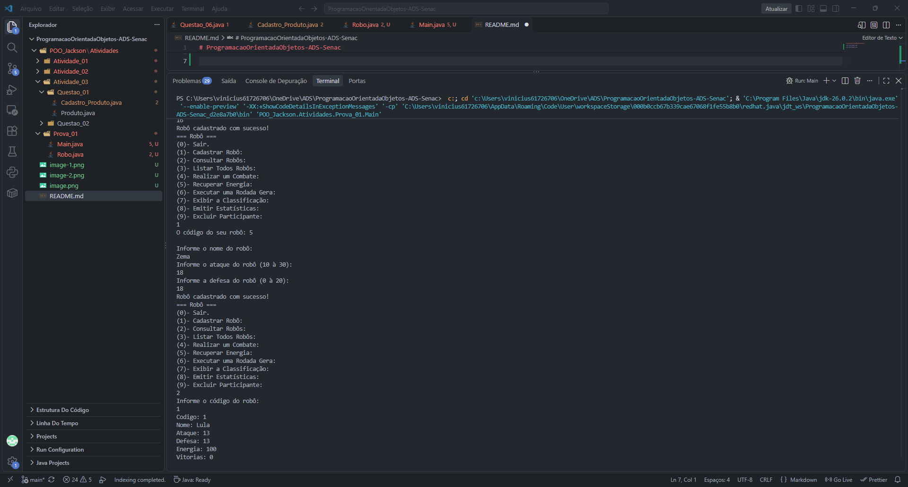
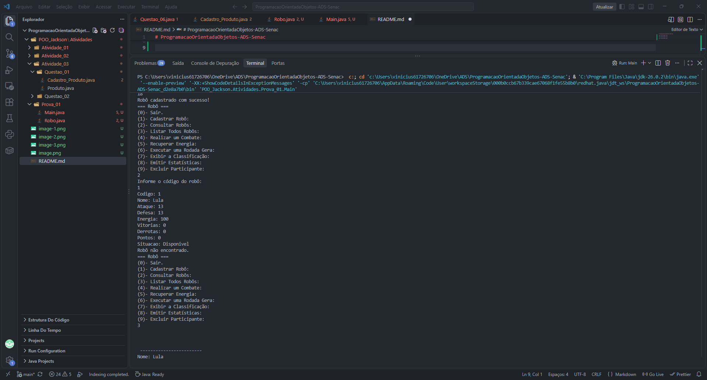
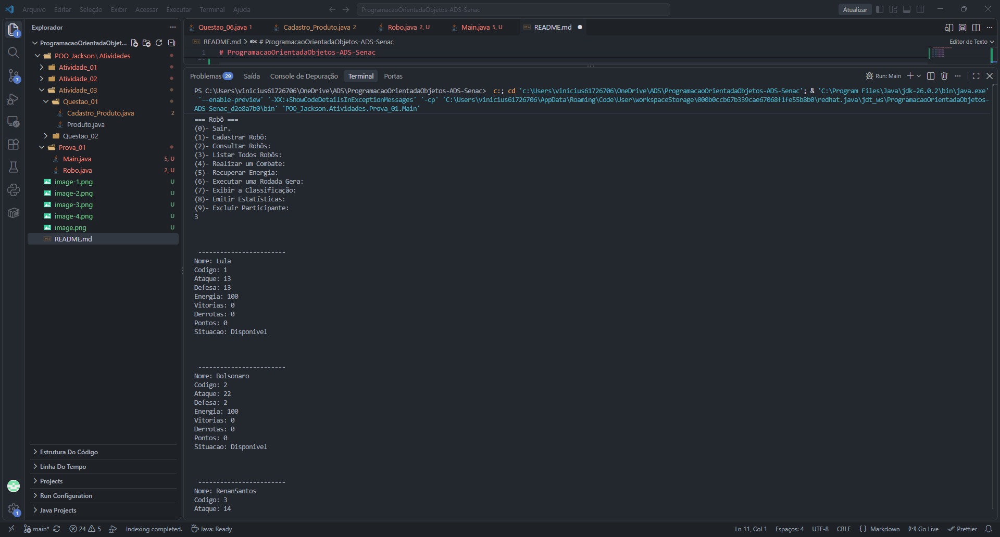
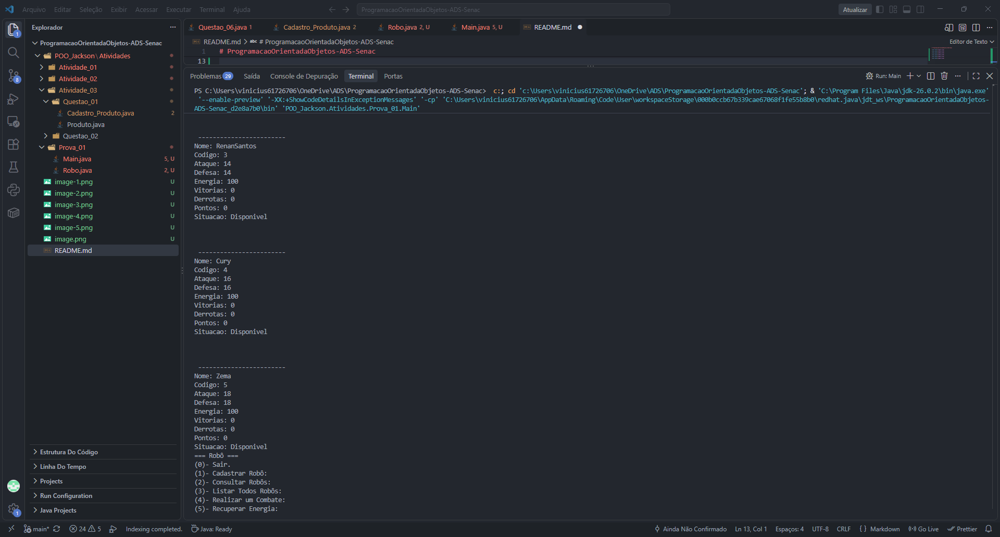
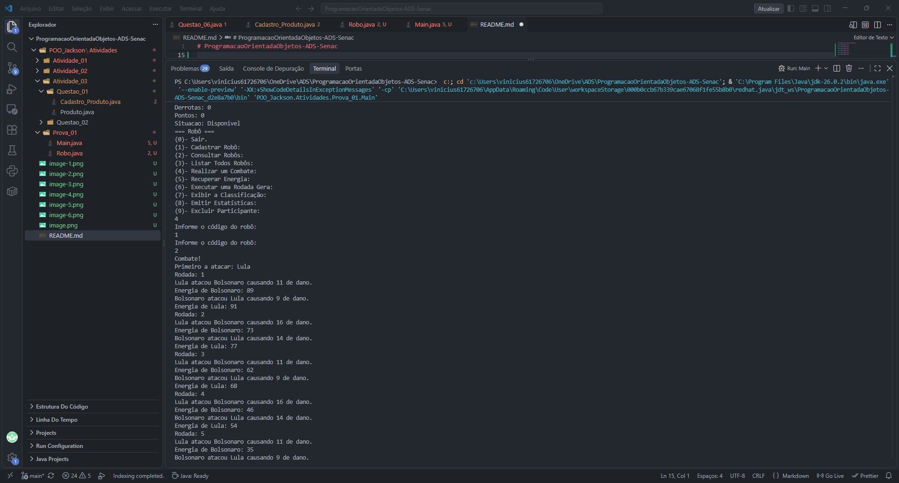
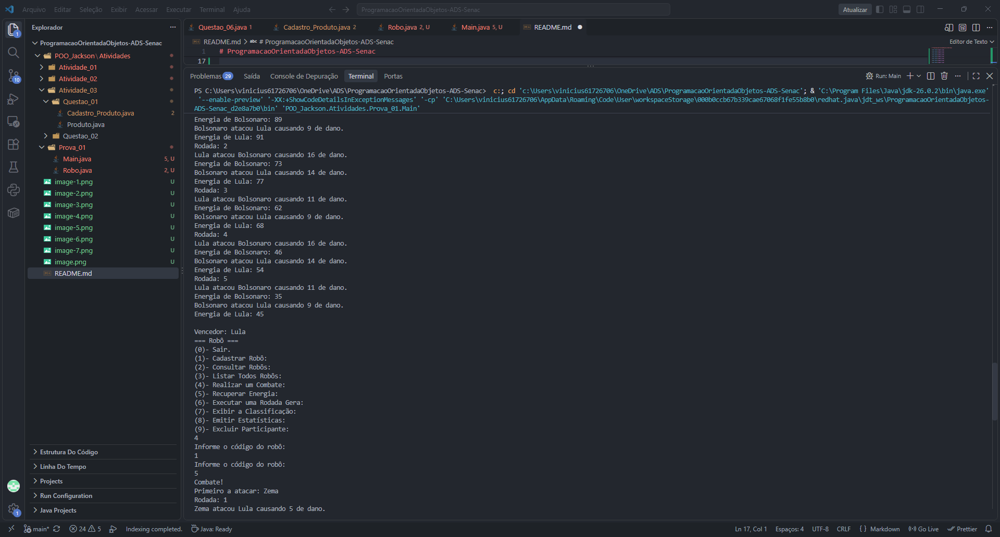
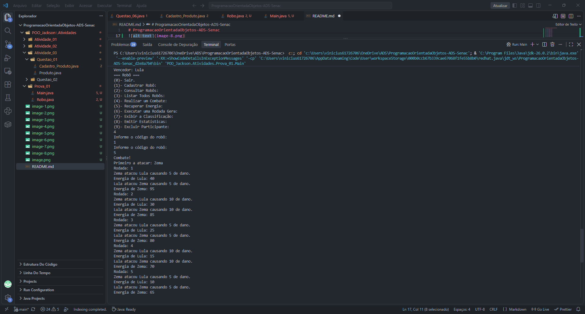

# ProgramacaoOrientadaObjetos-ADS-Senac

Sequência de comandos no terminal:
{
=== Robô ===
(0)- Sair.
(1)- Cadastrar Robô:
(2)- Consultar Robôs:
(3)- Listar Todos Robôs:
(4)- Realizar um Combate:
(5)- Recuperar Energia:
(6)- Executar uma Rodada Gera:
(7)- Exibir a Classificação:
(8)- Emitir Estatísticas:
(9)- Excluir Participante:
1
O código do seu robô: 1

Informe o nome do robô:
Lula
Informe o ataque do robô (10 à 30):
13
Informe a defesa do robô (0 à 20):
13
Robô cadastrado com sucesso!
=== Robô ===
(0)- Sair.
(1)- Cadastrar Robô:
(2)- Consultar Robôs:
(3)- Listar Todos Robôs:
(4)- Realizar um Combate:
(5)- Recuperar Energia:
(6)- Executar uma Rodada Gera:
(7)- Exibir a Classificação:
(8)- Emitir Estatísticas:
(9)- Excluir Participante:
1
O código do seu robô: 2

Informe o nome do robô:
Bolsonaro
Informe o ataque do robô (10 à 30):
22
Informe a defesa do robô (0 à 20):
2
Robô cadastrado com sucesso!
=== Robô ===
(0)- Sair.
(1)- Cadastrar Robô:
(2)- Consultar Robôs:
(3)- Listar Todos Robôs:
(4)- Realizar um Combate:
(5)- Recuperar Energia:
(6)- Executar uma Rodada Gera:
(7)- Exibir a Classificação:
(8)- Emitir Estatísticas:
(9)- Excluir Participante:
1  
O código do seu robô: 3

Informe o nome do robô:
RenanSantos
Informe o ataque do robô (10 à 30):
14
Informe a defesa do robô (0 à 20):
14
Robô cadastrado com sucesso!
=== Robô ===
(0)- Sair.
(1)- Cadastrar Robô:
(2)- Consultar Robôs:
(3)- Listar Todos Robôs:
(4)- Realizar um Combate:
(5)- Recuperar Energia:
(6)- Executar uma Rodada Gera:
(7)- Exibir a Classificação:
(8)- Emitir Estatísticas:
(9)- Excluir Participante:
1
O código do seu robô: 4

Informe o nome do robô:
Cury
Informe o ataque do robô (10 à 30):
16
Informe a defesa do robô (0 à 20):
16
Robô cadastrado com sucesso!
=== Robô ===
(0)- Sair.
(1)- Cadastrar Robô:
(2)- Consultar Robôs:
(3)- Listar Todos Robôs:
(4)- Realizar um Combate:
(5)- Recuperar Energia:
(6)- Executar uma Rodada Gera:
(7)- Exibir a Classificação:
(8)- Emitir Estatísticas:
(9)- Excluir Participante:
1
O código do seu robô: 5

Informe o nome do robô:
Zema
Informe o ataque do robô (10 à 30):
18
Informe a defesa do robô (0 à 20):
18
Robô cadastrado com sucesso!
=== Robô ===
(0)- Sair.
(1)- Cadastrar Robô:
(2)- Consultar Robôs:
(3)- Listar Todos Robôs:
(4)- Realizar um Combate:
(5)- Recuperar Energia:
(6)- Executar uma Rodada Gera:
(7)- Exibir a Classificação:
(8)- Emitir Estatísticas:
(9)- Excluir Participante:
2
Informe o código do robô:
1
Codigo: 1
Nome: Lula
Ataque: 13
Defesa: 13
Energia: 100
Vitorias: 0
Derrotas: 0
Pontos: 0
Situacao: Disponivel
Robô não encontrado.
=== Robô ===
(0)- Sair.
(1)- Cadastrar Robô:
(2)- Consultar Robôs:
(3)- Listar Todos Robôs:
(4)- Realizar um Combate:
(5)- Recuperar Energia:
(6)- Executar uma Rodada Gera:
(7)- Exibir a Classificação:
(8)- Emitir Estatísticas:
(9)- Excluir Participante:
3

---

Nome: Lula
Codigo: 1
Ataque: 13
Defesa: 13
Energia: 100
Vitorias: 0
Derrotas: 0
Pontos: 0
Situacao: Disponivel

---

Nome: Bolsonaro
Codigo: 2
Ataque: 22
Defesa: 2
Energia: 100
Vitorias: 0
Derrotas: 0
Pontos: 0
Situacao: Disponivel

---

Nome: RenanSantos
Codigo: 3
Ataque: 14
Defesa: 14
Energia: 100
Vitorias: 0
Derrotas: 0
Pontos: 0
Situacao: Disponivel

---

Nome: Cury
Codigo: 4
Ataque: 16
Defesa: 16
Energia: 100
Vitorias: 0
Derrotas: 0
Pontos: 0
Situacao: Disponivel

---

Nome: Zema
Codigo: 5
Ataque: 18
Defesa: 18
Energia: 100
Vitorias: 0
Derrotas: 0
Pontos: 0
Situacao: Disponivel
=== Robô ===
(0)- Sair.
(1)- Cadastrar Robô:
(2)- Consultar Robôs:
(3)- Listar Todos Robôs:
(4)- Realizar um Combate:
(5)- Recuperar Energia:
(6)- Executar uma Rodada Gera:
(7)- Exibir a Classificação:
(8)- Emitir Estatísticas:
(9)- Excluir Participante:
4
Informe o código do robô:
1
Informe o código do robô:
2
Combate!
Primeiro a atacar: Lula
Rodada: 1
Lula atacou Bolsonaro causando 11 de dano.
Energia de Bolsonaro: 89
Bolsonaro atacou Lula causando 9 de dano.
Energia de Lula: 91
Rodada: 2
Lula atacou Bolsonaro causando 16 de dano.
Energia de Bolsonaro: 73
Bolsonaro atacou Lula causando 14 de dano.
Energia de Lula: 77
Rodada: 3
Lula atacou Bolsonaro causando 11 de dano.
Energia de Bolsonaro: 62
Bolsonaro atacou Lula causando 9 de dano.
Energia de Lula: 68
Rodada: 4
Lula atacou Bolsonaro causando 16 de dano.
Energia de Bolsonaro: 46
Bolsonaro atacou Lula causando 14 de dano.
Energia de Lula: 54
Rodada: 5
Lula atacou Bolsonaro causando 11 de dano.
Energia de Bolsonaro: 35
Bolsonaro atacou Lula causando 9 de dano.
Energia de Lula: 45

Vencedor: Lula
=== Robô ===
(0)- Sair.
(1)- Cadastrar Robô:
(2)- Consultar Robôs:
(3)- Listar Todos Robôs:
(4)- Realizar um Combate:
(5)- Recuperar Energia:
(6)- Executar uma Rodada Gera:
(7)- Exibir a Classificação:
(8)- Emitir Estatísticas:
(9)- Excluir Participante:
4
Informe o código do robô:
1
Informe o código do robô:
5
Combate!
Primeiro a atacar: Zema
Rodada: 1
Zema atacou Lula causando 5 de dano.
Energia de Lula: 40
Lula atacou Zema causando 5 de dano.
Energia de Zema: 95
Rodada: 2
Zema atacou Lula causando 10 de dano.
Energia de Lula: 30
Lula atacou Zema causando 10 de dano.
Energia de Zema: 85
Rodada: 3
Zema atacou Lula causando 5 de dano.
Energia de Lula: 25
Lula atacou Zema causando 5 de dano.
Energia de Zema: 80
Rodada: 4
Zema atacou Lula causando 10 de dano.
Energia de Lula: 15
Lula atacou Zema causando 10 de dano.
Energia de Zema: 70
Rodada: 5
Zema atacou Lula causando 5 de dano.
Energia de Lula: 10
Lula atacou Zema causando 5 de dano.
Energia de Zema: 65

Vencedor: Zema
=== Robô ===
(0)- Sair.
(1)- Cadastrar Robô:
(2)- Consultar Robôs:
(3)- Listar Todos Robôs:
(4)- Realizar um Combate:
(5)- Recuperar Energia:
(6)- Executar uma Rodada Gera:
(7)- Exibir a Classificação:
(8)- Emitir Estatísticas:
(9)- Excluir Participante:
2
Informe o código do robô:
5
Codigo: 5
Nome: Zema
Ataque: 18
Defesa: 18
Energia: 65
Vitorias: 1
Derrotas: 0
Pontos: 3
Situacao: Disponivel
Robô não encontrado.
}
